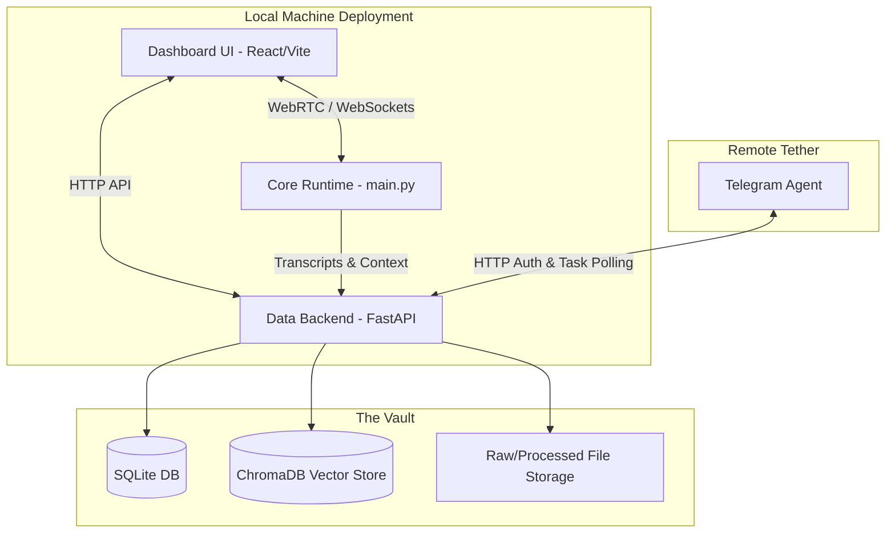

<div align="center">

# 🧠 Project Aria: The Autonomous Neural Assistant Ecosystem


<p align="center">
  <b>A completely autonomous, privacy-first, locally-deployable AI entity capable of attending meetings, seeing through your camera, remembering interactions in a vector-graph hybrid memory vault, and interacting via web dashboard and Telegram.</b>
</p>

<p align="center">
  <i>Concept by Raghav Agarwal (raghavhavefun@gmail.com) and Sean Reeves (hubtulum@gmail.com)</i>
</p>

</div>

---

## 📖 Comprehensive Table of Contents

1. [Introduction to Project Aria](#1-introduction-to-project-aria)
2. [Core Philosophy & Mission](#2-core-philosophy--mission)
3. [Exhaustive Feature Breakdown](#3-exhaustive-feature-breakdown)
4. [High-Level Architecture & Data Flow](#4-high-level-architecture--data-flow)
5. [Tech Stack & Dependencies](#5-tech-stack--dependencies)
6. [Hardware & Software Prerequisites](#6-hardware--software-prerequisites)
7. [Step-by-Step Installation Guide (All Platforms)](#7-step-by-step-installation-guide-all-platforms)
8. [Environment Variable Configuration Guide](#8-environment-variable-configuration-guide)
9. [Component Deep Dive](#9-component-deep-dive)
    - [9.1 The Data Backend & Vault](#91-the-data-backend--vault)
    - [9.2 The Core Runtime & Brain](#92-the-core-runtime--brain)
    - [9.3 The Dashboard UI](#93-the-dashboard-ui)
    - [9.4 The Telegram Agent](#94-the-telegram-agent)
10. [Detailed Usage & Operational Workflows](#10-detailed-usage--operational-workflows)
11. [Understanding the Memory Engine](#11-understanding-the-memory-engine)
12. [API Reference & Endpoints](#12-api-reference--endpoints)
13. [Code Structure & Module Breakdown](#13-code-structure--module-breakdown)
14. [Extensive Troubleshooting Guide](#14-extensive-troubleshooting-guide)
15. [Developer Guide & Contributing](#15-developer-guide--contributing)
16. [Security & Privacy Standards](#16-security--privacy-standards)
17. [Roadmap & Future Horizons](#17-roadmap--future-horizons)
18. [License & Acknowledgements](#18-license--acknowledgements)

---

## 1. Introduction to Project Aria

Welcome to **Project Aria**. In a digital landscape dominated by fragmented tools and cloud-hosted assistants that lock away your data, Project Aria represents a paradigm shift. It is a unified, locally deployable ecosystem designed to give you a sovereign digital proxy. 

Project Aria is not just a chatbot. It is an agentic system that can:
- **Join your Google Meet calls** autonomously using headless browser automation.
- **Transcribe and understand** multi-party conversations in real-time.
- **Extract action items** and synthesize insights.
- **Store knowledge** in a secure, local Long-Term Memory (LTM) vault powered by ChromaDB.
- **Interact with you** via a rich, 3D animated WebRTC avatar on a dedicated React dashboard.
- **Accept remote commands** from a securely authenticated Telegram tether.

Whether you are an executive looking to automate meeting notes, a developer wanting a highly hackable AI infrastructure, or a privacy advocate seeking a local-first digital companion, Project Aria provides the architectural foundation.

---

## 2. Core Philosophy & Mission

### 🛡️ Absolute Privacy First
Your data is your data. Traditional corporate assistants send your voice, your documents, and your private meetings to opaque cloud servers for training. Project Aria stores all memory, transcripts, and embeddings **locally on your machine**. You own the databases. You control the vault. If you turn the machine off, your data remains yours.

### 🤖 True Autonomy
An assistant should not wait idly for a text prompt. Aria is designed to be proactive. Through the Telegram integration and local scheduling systems, Aria can be instructed to "Join my meeting in 5 minutes," allowing the system to boot a Playwright instance, navigate waiting rooms, and begin transcribing—while you are getting coffee.

### 🌐 Multi-Modal Fluidity
Humans communicate through voice, sight, and text. Aria mirrors this. The core runtime manages WebRTC streams to handle real-time voice, processes visual cues if configured, and communicates asynchronously via Telegram for text. The system unifies these modalities into a single, cohesive memory stream.

---

## 3. Exhaustive Feature Breakdown

- **Real-Time 3D Neural Avatar:** Utilizing WebRTC, the frontend dashboard connects directly to the Python core to stream low-latency audio. As the TTS engine speaks, audio buffers are converted into blendshapes, driving a 3D avatar in real-time.
- **Headless Meeting Integration:** Built-in Playwright automation for Google Meet. The bot can navigate UI, click "Ask to Join," monitor participant lists, and inject system audio.
- **Dual-Stage Memory Retrieval (RAG):**
    - **Stage 1 (Dense Retrieval):** Uses BAAI/bge-m3 embeddings to query ChromaDB.
    - **Stage 2 (Cross-Encoder Reranking):** Uses BAAI/bge-reranker-base to score and sort the top chunks, ensuring hyper-relevant context injection.
- **Multi-Tenant Telegram Tether:** A robust Telegram bot that acts as a remote control. It requires OTP authentication (via Supabase) ensuring that only you can command your instance.
- **Dashboard Interface:** A Vite/React-powered UI that acts as the command center. View the "Memory Vault," initiate manual chats, or monitor the internal thought process of the agent.
- **Automated Summarization Pipeline:** As soon as a meeting concludes, Aria automatically runs a summarization pass, extracts action items, creates embedding chunks, and saves them to the local SQLite/Chroma pipeline.

---

## 4. High-Level Architecture & Data Flow

Project Aria is composed of four primary, deeply integrated components. They run concurrently to form the ecosystem.



1. **Dashboard UI:** The face of Aria. Connects via WebSockets/WebRTC to the Core Runtime for avatar streaming, and via HTTP to the Data Backend for memory exploration.
2. **Core Runtime:** The central nervous system. It orchestrates the audio capture, TTS, Playwright meeting automation, and the main reasoning loop.
3. **Data Backend:** The memory controller. A FastAPI server that manages all read/write operations to SQLite and ChromaDB.
4. **Telegram Agent:** The remote nervous system. It polls for messages, authenticates users, and writes pending tasks (like joining a meeting) into the Data Backend.

---

## 5. Tech Stack & Dependencies

### Core AI & Backend
- **Python 3.11+**: The bedrock of the backend and AI orchestration.
- **FastAPI & Uvicorn**: High-performance asynchronous web framework for the memory API.
- **ChromaDB**: The local vector database powering the dense retrieval system.
- **SQLite3**: Lightweight relational database for structured metadata and system state.
- **Sentence-Transformers**: Powers the local embedding (bge-m3) and reranking models.
- **Playwright**: Automates Chromium to interface with Google Meet and web applications.
- **PyAudio**: Interfaces with the local machine's audio hardware for mic/speaker capture.

### Frontend Dashboard
- **React 18 & ReactDOM**: Component-based UI rendering.
- **Vite**: Next-generation, lightning-fast frontend build tooling.
- **TailwindCSS**: Utility-first styling framework for the UI components.
- **WebRTC**: Real-time peer-to-peer communication protocol for avatar streaming.

### Integrations
- **python-telegram-bot (v20+)**: Asynchronous framework handling the Telegram API.
- **Supabase**: Used specifically for the secure OTP (One-Time Password) email authentication flow in the Telegram tether.
- **Groq API**: High-speed LLM inference endpoint (configurable/swappable).

---

## 6. Hardware & Software Prerequisites

To run Project Aria smoothly, your system must meet the following requirements. 

### Minimum Hardware
- **Processor:** Intel Core i5 (8th Gen+) / AMD Ryzen 5 or Apple Silicon (M1+).
- **RAM:** Minimum 16GB. The vector models and headless browser require significant memory.
- **Storage:** At least 50GB of free SSD space. Do not use an HDD, as vector retrieval will be bottlenecked by disk read speeds.
- **Audio:** A working microphone and speaker system (Virtual Audio Cables are highly recommended for advanced routing).

### Recommended Hardware (For Heavy Usage)
- **RAM:** 32GB.
- **GPU:** NVIDIA RTX 3060 or higher (8GB+ VRAM) to run embedding generation locally via CUDA.

### Software Requirements
- **Operating System:** Windows 10/11, macOS 12+, or Ubuntu 22.04 LTS.
- **Python:** Exactly `3.11.x` is highly recommended for maximum dependency compatibility.
- **Node.js:** `v18.x` or higher (includes `npm`).
- **Git:** For cloning and version control.
- **FFmpeg:** Crucial for audio processing. Must be installed and added to your system's `PATH`.

---

## 7. Step-by-Step Installation Guide (All Platforms)

This guide assumes you are starting from a completely blank slate. Please follow the instructions meticulously.

### Step 7.1: Clone the Repository
Open your terminal or command prompt and clone the project:
```bash
git clone https://github.com/your-username/Project_Aria.git
cd Project_Aria
```

### Step 7.2: Initialize the Python Environment
It is strictly required to use a Virtual Environment to avoid polluting your global Python installation.

**For Windows:**
```powershell
python -m venv venv
.\venv\Scripts\activate
```

**For macOS/Linux:**
```bash
python3 -m venv venv
source venv/bin/activate
```

### Step 7.3: Install Python Dependencies
With the virtual environment active, install the core requirements:
```bash
pip install -r requirements.txt
```
*(Note: If you have an NVIDIA GPU, you may want to install the PyTorch CUDA binaries separately before running this step for hardware acceleration).*

Next, install the specific requirements for the Telegram agent:
```bash
pip install -r telegram_agent/requirements.txt
```

### Step 7.4: Install & Configure Playwright
Aria uses Playwright to join meetings. You must download the browser binaries:
```bash
playwright install chromium
```
*(This will download a specific version of Chromium customized for Playwright).*

### Step 7.5: Install Frontend Dependencies
Navigate into the dashboard folder and install the Node packages:
```bash
cd dashboard
npm install
cd ..
```

### Step 7.6: Initialize the Directory Structure
Project Aria requires specific folders to store its databases and logs. Create them by running:
```bash
mkdir -p data_vault/sqlite
mkdir -p data_vault/chroma
mkdir -p data_vault/raw
mkdir -p data_vault/processed
mkdir -p meetings
```

### Step 7.7: Audio Routing Setup (Optional but Recommended for Meetings)
If you want Aria to hear the meeting audio *and* your microphone simultaneously on Windows, you should install software like **VB-Audio Virtual Cable**. Route your browser's output to the Virtual Cable, and configure PyAudio in `modules/audio_capture.py` to listen to that specific input device.

---

## 8. Environment Variable Configuration Guide

Project Aria relies on a `.env` file at the root of the repository to manage paths and API keys securely.

1. In the root directory (`Project_Aria/`), create a file named exactly `.env`.
2. Copy and paste the following template into the file.
3. Replace the placeholder values with your actual keys.

```env
# ==========================================
# 1. DIRECTORY CONFIGURATION
# ==========================================
# Absolute paths to where data will be stored. Update the drive letter/path based on your OS.
DATA_VAULT_ROOT=D:/AI/Project_Aria/data_vault
SQLITE_PATH=D:/AI/Project_Aria/data_vault/sqlite/aria_memory.db
CHROMA_PATH=D:/AI/Project_Aria/data_vault/chroma

# ==========================================
# 2. VECTOR MEMORY MODELS
# ==========================================
# The HuggingFace models used for embeddings. Do not change unless you understand the architecture.
EMBED_MODEL=BAAI/bge-m3
RERANK_MODEL=BAAI/bge-reranker-base
MAX_CHUNK_TOKENS=900
CHUNK_OVERLAP=120

# ==========================================
# 3. LLM API KEYS
# ==========================================
# Used for fast inference. Can be swapped for OpenAI or Local models in code.
GROQ_API_KEY=your_groq_api_key_here
LOS_GROQ_API_KEY=your_los_groq_api_key_here
AUTOMATION_CRED_MASTER_KEY=your_automation_cred_master_key_here

# ==========================================
# 4. TELEGRAM & SUPABASE AUTHENTICATION
# ==========================================
# Supabase is used to send OTP emails so your Telegram bot remains secure.
SUPABASE_URL=your_supabase_url_here
SUPABASE_ANON_KEY=your_supabase_anon_key_here
SUPABASE_SERVICE_ROLE_KEY=your_supabase_service_role_key_here

# The Bot Token you received from BotFather on Telegram
TELEGRAM_BOT_KEY=your_telegram_bot_key_here
```

### How to get the keys:
- **Groq API Key:** Sign up at console.groq.com.
- **Supabase Keys:** Create a free project at supabase.com. Go to Project Settings -> API.
- **Telegram Bot Key:** Message `@BotFather` on Telegram, send `/newbot`, follow the steps, and copy the HTTP API Token.

---

## 9. Component Deep Dive

### 9.1 The Data Backend & Vault
Located in the `data_backend/` folder, this FastAPI application serves on port `8001`. It is the source of truth for the entire ecosystem.
- **Ingestion:** When a text payload is sent to `/api/ingest`, the backend cleans the text, splits it according to `MAX_CHUNK_TOKENS`, generates vectors using `SentenceTransformers`, and inserts them into ChromaDB.
- **Metadata:** At the same time, it logs the document reference, timestamp, and source (e.g., "Meeting", "Upload") into the SQLite database.
- **Retrieval:** When `/api/search` is called, it performs a dense retrieval on ChromaDB, fetches the top `K` results, and passes them through the cross-encoder reranker to return only the most relevant context.

### 9.2 The Core Runtime & Brain
Driven by `main.py` at the root. This script initializes:
- `modules/meeting_joiner.py`: The Playwright script that handles Google Meet URLs.
- `modules/audio_capture.py`: Handles threaded recording of system audio.
- `modules/brain.py`: The LLM logic. It intercepts user commands, queries the Data Backend for context, and generates responses.
- The Core Runtime also hosts the WebRTC signaling endpoints allowing the dashboard to connect and stream the Avatar's voice.

### 9.3 The Dashboard UI
Located in `dashboard/`. It is a Vite + React application running on port `5173`.
- **Pages:** Includes a Home screen for the Avatar, a Data screen to view the Vault, and Settings.
- **WebRTC:** Uses advanced browser APIs to establish a peer-to-peer connection with the Python Core Runtime, avoiding HTTP latency for real-time conversation.

### 9.4 The Telegram Agent
Located in `telegram_agent/`. It runs as a completely independent process.
- **Security:** It maps a user's Telegram ID to their email address. It requires the user to input an OTP sent to their email via Supabase before accepting commands.
- **Polling:** It uses long-polling to listen for commands.
- **Integration:** When you text `join now <url>`, the agent parses the intent and makes an HTTP POST request to the Data Backend, which in turn signals the Core Runtime to launch the browser.

---

## 10. Detailed Usage & Operational Workflows

To operate the entire Project Aria ecosystem, you must run the components concurrently. This requires opening multiple terminal windows.

### Terminal A: The Data Backend
This must be started first, as all other components rely on its API.
```powershell
cd Project_Aria
.\venv\Scripts\activate
python run_data_backend.py
```
*Wait for: `Uvicorn running on http://127.0.0.1:8001 (Press CTRL+C to quit)`*

### Terminal B: The Dashboard UI
Start the frontend interface.
```powershell
cd Project_Aria\dashboard
npm run dev
```
*Open your browser to `http://localhost:5173` to view the UI.*

### Terminal C: The Core Runtime
Start the brain and meeting automation orchestrator.
```powershell
cd Project_Aria
.\venv\Scripts\activate
python main.py
```
*Wait for: `System initialized. Awaiting tasks.`*

### Terminal D: The Telegram Agent (Optional)
If you want to use the remote control capabilities.

**First Time Setup (Linking your Account):**
```powershell
cd Project_Aria
.\venv\Scripts\activate
python telegram_agent/setup_bot.py
```
*Follow the prompts to enter your email and bot token.*

**Running the Bot:**
```powershell
python telegram_agent/run_bot.py --account your_email@example.com
```

### Daily Workflows

**Workflow 1: Joining a Meeting Manually**
1. Open the Dashboard (`http://localhost:5173`).
2. Paste the Google Meet link into the input box and click "Join".
3. Watch the Core Runtime terminal as Playwright boots Chromium, navigates to the meeting, mutes the mic, and enters the room.

**Workflow 2: Remote Meeting Scheduling**
1. Open Telegram on your phone.
2. Text the bot: `/start` and authenticate if necessary.
3. Text: `schedule https://meet.google.com/abc-defg-hij at 2026-10-15 14:00`
4. The bot will save the schedule. The Core Runtime will automatically boot 5 minutes before the meeting starts.

**Workflow 3: Querying Memory**
1. On the Dashboard, go to the "Vault" tab.
2. Type a question like: "What did John say about the Q3 marketing budget last week?"
3. The system will query ChromaDB, rerank the results, and provide a synthesized answer based *only* on your actual meeting transcripts.

---

## 11. Understanding the Memory Engine

The LTM (Long-Term Memory) is the crown jewel of Project Aria.

**The Problem:** Traditional LLMs have a finite context window. You cannot pass 100 meeting transcripts into a prompt.
**The Aria Solution:**
1. **Chunking:** Transcripts are split into semantic paragraphs of ~900 tokens.
2. **Embedding:** The `BAAI/bge-m3` model converts these text chunks into dense, high-dimensional numerical vectors. These vectors capture the *meaning* of the text.
3. **Storage:** The vectors are saved in ChromaDB. The exact text and metadata (Date, People) are saved in SQLite.
4. **Retrieval:** When you ask a question, your question is also turned into a vector. ChromaDB finds the closest matching vectors using cosine similarity.
5. **Reranking:** Because simple similarity can be noisy, the top 20 results are passed to `BAAI/bge-reranker-base`. This model acts as a highly intelligent judge, re-scoring the chunks based on their absolute relevance to the question.
6. **Synthesis:** Only the top 3-5 perfectly matched chunks are passed to the LLM (Groq) to generate your final answer.

---

## 12. API Reference & Endpoints

The Data Backend exposes several RESTful endpoints.

### `GET /health`
Returns the status of the SQLite and ChromaDB connections.

### `POST /api/ingest`
Payload:
```json
{
  "text": "The raw transcript or document text...",
  "source": "meeting_20261015",
  "metadata": {"participants": ["John", "Maya"]}
}
```
**Action:** Chunks, embeds, and stores the text.

### `POST /api/search`
Payload:
```json
{
  "query": "What were the marketing budget numbers?",
  "top_k": 5
}
```
**Action:** Performs dense retrieval and reranking, returning the most relevant text chunks.

---

## 13. Code Structure & Module Breakdown

For developers looking to modify the codebase, here is the organizational structure:

```text
Project_Aria/
│
├── .env                       # Environment variables (You create this)
├── main.py                    # The Core Runtime entry point
├── run_data_backend.py        # The FastAPI server entry point
├── requirements.txt           # Python dependencies
├── README.md                  # This file
│
├── data_backend/              # FastAPI Logic
│   ├── server.py              # Route definitions
│   ├── database.py            # SQLite ORM and schemas
│   └── vector_store.py        # ChromaDB and SentenceTransformer logic
│
├── modules/                   # Core Runtime Logic
│   ├── brain.py               # LLM integration and prompt engineering
│   ├── meeting_joiner.py      # Playwright browser automation
│   ├── audio_capture.py       # PyAudio stream handling
│   └── tts_engine.py          # Text-to-Speech generation
│
├── dashboard/                 # React/Vite Frontend
│   ├── package.json           
│   ├── index.html             
│   └── src/                   
│       ├── App.jsx            # Main React Component
│       ├── components/        # Reusable UI elements
│       └── styles/            # Tailwind CSS files
│
├── telegram_agent/            # Remote Tether Logic
│   ├── run_bot.py             # Polling entry point
│   ├── setup_bot.py           # First-time config
│   ├── auth_supabase.py       # OTP Logic
│   └── intent_parser.py       # NLP for understanding text commands
│
└── scripts/                   # Utility Scripts
    └── sync_meetings.py       # Bulk ingestion of old meetings
```

---

## 14. Extensive Troubleshooting Guide

### Issue: `Playwright: Browser Type Executable Not Found`
**Cause:** You skipped the browser installation step.
**Solution:** Open terminal, activate your virtual environment, and run `playwright install chromium`.

### Issue: `telegram.error.TimedOut: Timed out`
**Cause:** Your machine cannot establish a TCP connection to `api.telegram.org`. This is very common in regions where Telegram is blocked by ISPs, or on strict corporate networks.
**Solution:** You must run a system-wide VPN or configure a proxy in your network settings.

### Issue: `OSError: [Errno 98] Address already in use` (Port 8001)
**Cause:** The Data Backend crashed previously but left the process running in the background, holding the port open.
**Solution (Windows):**
```powershell
Get-Process -Id (Get-NetTCPConnection -LocalPort 8001).OwningProcess | Stop-Process -Force
```
**Solution (Mac/Linux):**
```bash
lsof -ti:8001 | xargs kill -9
```

### Issue: `ModuleNotFoundError: No module named 'chromadb'`
**Cause:** You are running the scripts outside of your virtual environment.
**Solution:** Always ensure your terminal shows `(venv)` at the prompt. Run `.\venv\Scripts\activate` (Windows) or `source venv/bin/activate` (Mac/Linux) before running `python main.py`.

### Issue: Cannot delete `data_vault` folders
**Cause:** Windows locks SQLite and ChromaDB files while the Python process is running.
**Solution:** Stop `run_data_backend.py` (Ctrl+C) before attempting to manually clear or delete the memory vault folders.

---

## 15. Developer Guide & Contributing

Project Aria thrives on open-source contributions. If you want to build a new feature, follow these steps:

### Setting up for Development
1. Fork the repository on GitHub.
2. Clone your fork locally.
3. Set up the environments as per the Installation Guide.
4. Create a feature branch: `git checkout -b feature/your-amazing-feature`.

### Contribution Guidelines
- **Python Formatting:** We adhere strictly to PEP-8. Please run `black` and `flake8` on your code before submitting a PR.
- **React Formatting:** Use `prettier` for all `.jsx` and `.css` files.
- **Documentation:** If you add a new module, you must add a corresponding section to this README and include docstrings in your Python functions.

### Pull Request Process
1. Commit your changes: `git commit -m "Add Amazing Feature"`
2. Push to your branch: `git push origin feature/your-amazing-feature`
3. Open a Pull Request on the main repository. A maintainer will review your code.

---

## 16. Security & Privacy Standards

We take security seriously. 
- **No Cloud Memory:** All vector databases and SQLite files are strictly kept in `data_vault/` and are actively ignored by Git via the `.gitignore` file.
- **Authentication:** The Telegram agent does not blindly accept commands from anyone who finds the bot. It verifies the Telegram User ID against a securely mapped email database, backed by Supabase OTP.
- **Data Scrubbing:** The open-source version of this repository has been strictly audited to ensure no API keys, private emails, or meeting transcripts are included in the source code.

**If you discover a security vulnerability, please do NOT open a public issue. Reach out to the maintainers directly.**

---

## 17. Roadmap & Future Horizons

Project Aria is evolving rapidly. Here is our technical roadmap:

- [x] **Phase 1: Core Automation** - Headless Google Meet joining and transcript extraction.
- [x] **Phase 2: The Vault** - Implementation of ChromaDB and the dual-stage RAG pipeline.
- [x] **Phase 3: Remote Tethering** - Secure Telegram agent integration.
- [ ] **Phase 4: Local LLMs** - Replacing Groq API dependencies with native `vLLM` or `Ollama` integrations to allow the system to run 100% offline without external API keys.
- [ ] **Phase 5: Multi-Agent Spawning** - Allowing Aria to spawn sub-agents during a meeting to concurrently research topics being discussed.
- [ ] **Phase 6: Advanced Voice Pipelines** - Integrating ultra-low latency local TTS (e.g., Piper) and local STT (e.g., Whisper.cpp) to bypass cloud audio processing.
- [ ] **Phase 7: Hardware Integrations** - Exporting the agent state to run on dedicated Raspberry Pi / Jetson Nano hardware for physical embodiment.

---

## 18. License & Acknowledgements

### License
Project Aria is released under the **MIT License**. You are free to use, modify, and distribute this software for personal or commercial purposes, provided you include the original copyright notice. See the `LICENSE` file for details.

### Acknowledgements
Building a system of this complexity requires standing on the shoulders of giants. We deeply thank the maintainers and communities behind:
- **FastAPI** for revolutionizing Python web frameworks.
- **ChromaDB** for democratizing vector storage.
- **BAAI** for open-sourcing the incredible `bge-m3` embedding models.
- **Playwright** for making browser automation robust and reliable.
- **Vite & React** for the frontend experience.

---

<div align="center">
  <p><b>Built with ❤️ for the future of Sovereign AI.</b></p>
  <p>If Project Aria helped you, consider giving the repository a ⭐ on GitHub!</p>
</div>
